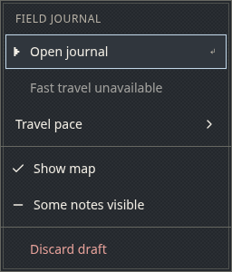
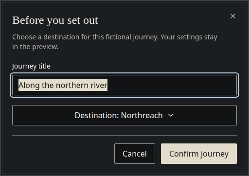
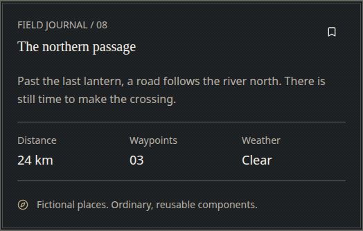
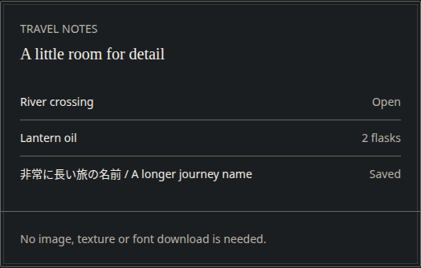

# Original reference studies

These are original DOM studies of the restrained menu direction described in the
v0.1 brief. They are **not game screenshots**, traced artwork, or a claim of
pixel fidelity to Octopath Traveler. All images come from the canonical prototype.
The user approved the palette and system-font approach at the M1 gate.

| Reference area                | Traits adapted from the brief                                                       | Original study                                                                                                               |
| ----------------------------- | ----------------------------------------------------------------------------------- | ---------------------------------------------------------------------------------------------------------------------------- |
| Navigation menu               | Compact rows, reserved leading diamond, thin pale rule, quiet horizontal highlight  | [Menu](review/menu-highlight.png)                                                                                            |
| Item list                     | Aligned values, fine dividers, long labels and CJK fallback                         | [Travel notes](review/item-list.png)                                                                                         |
| Confirmation dialog           | Framed dark panel, literary heading, clear action group, modest backdrop            | [Journey dialog](review/dialog.png)                                                                                          |
| Status panel                  | Measured information groups, tabular numbers, limited ornament                      | [Field journal](review/status-panel.png)                                                                                     |
| Selected / disabled / focused | Checkmark for checked, dash for mixed, dimmed disabled item, separate focus outline | [Menu states](review/menu-highlight.png), [Button focus](review/button-focus.png), [Forced colors](review/forced-colors.png) |

The studies deliberately use opaque surfaces, no scenic image, no pixel font,
no game branding and no downloaded texture. Warm brass appears only in small
section labels and decorative details; primary actions use ivory.

These documentation images are **review candidates**, not library dependencies.
They can change after design feedback. User approval has not been inferred from
successful automated checks.
